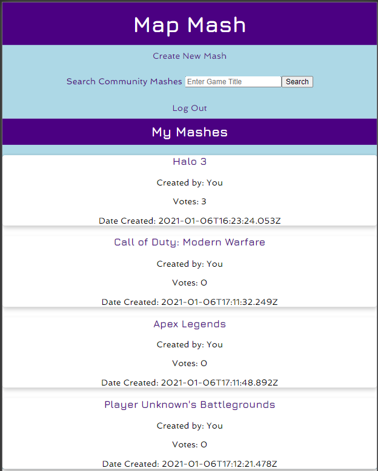
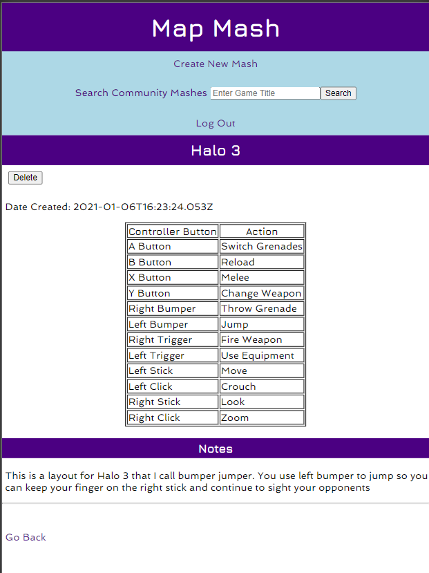
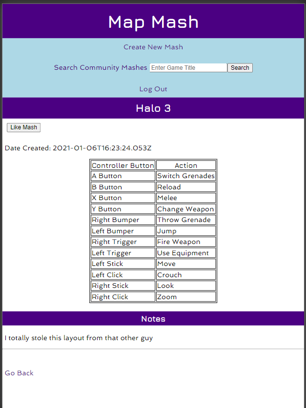
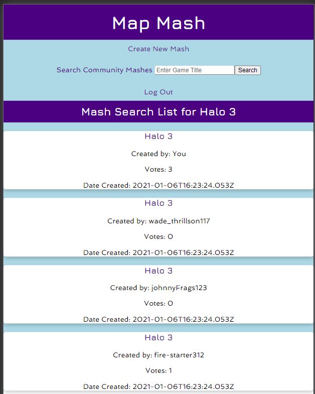

# Map Mash Client

https://map-mash.netlify.app

## Description

This is the Map Mash Client, which is an application that allows users to create their custom controller button configurations (Mashes) for their favorite video games. The mash cards for these mashes will appear on the homepage. The game titles may be clicked to reveal the mash with a button/action table and the notes.

The user is required to enter a game title, and they may enter an action for each button on the controller. Any action left blank will be assigned the string 'Not Used'. The user may also enter any notes about their Mash they want to make. The user may also delete a mash.

Users may also enter a game title in the search input in the nav which will render a search list of all mash cards for that title by any user. Once again, users may click on the game title to see the mash. If a user clicks on another user's mash, the delte button is replaced with a like button, where you may 'like' mashes posted by other users. Users may only like the mash of another user one time. You can click the Map Mash header at the top of the page to redirect to the home page at any time while you are logged in.

Map Mash is a PERN application, cosisting of PostgreSQL, Express, React and Node.js.

